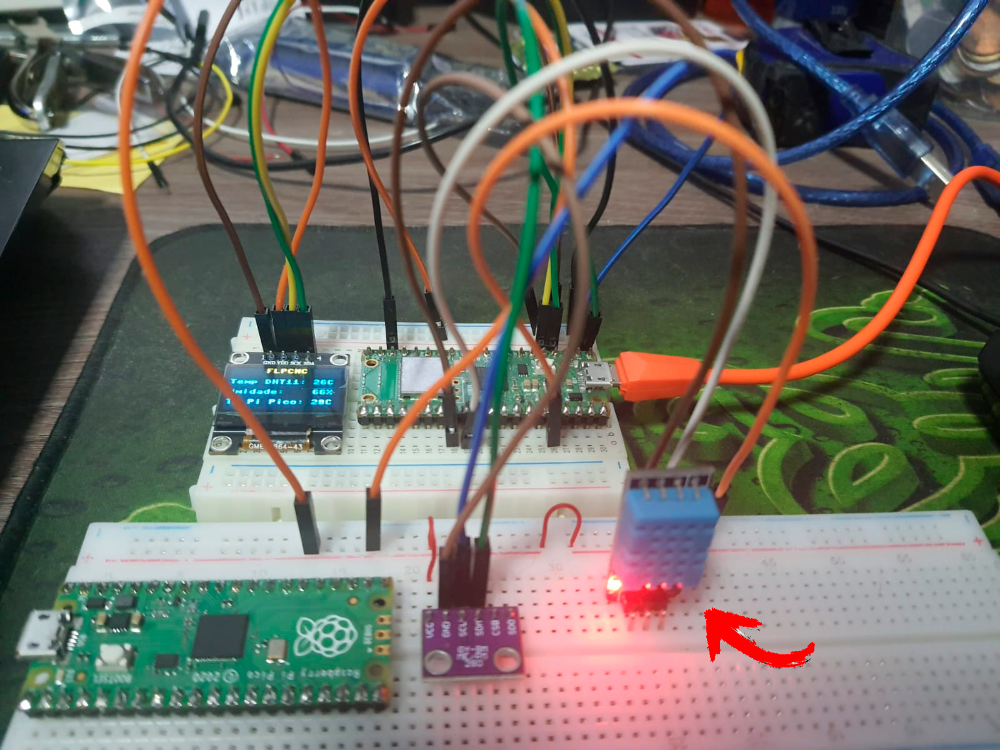
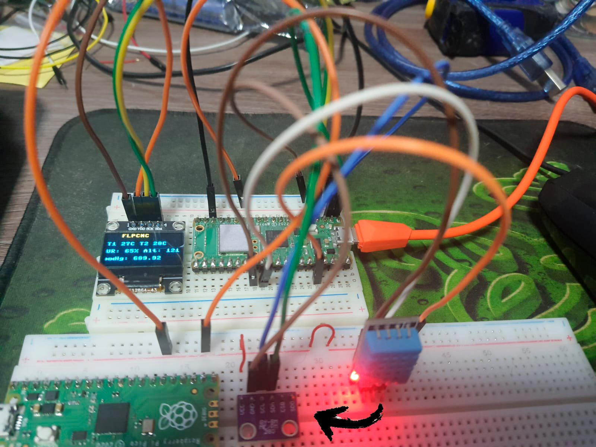
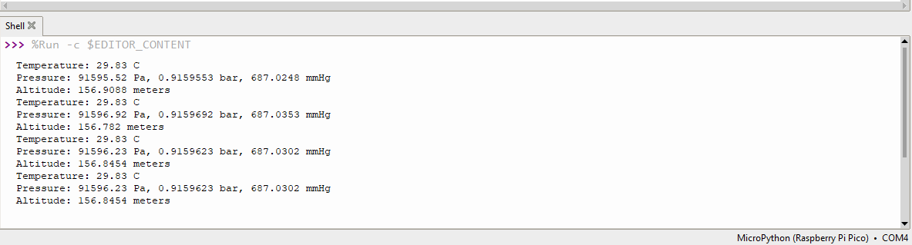
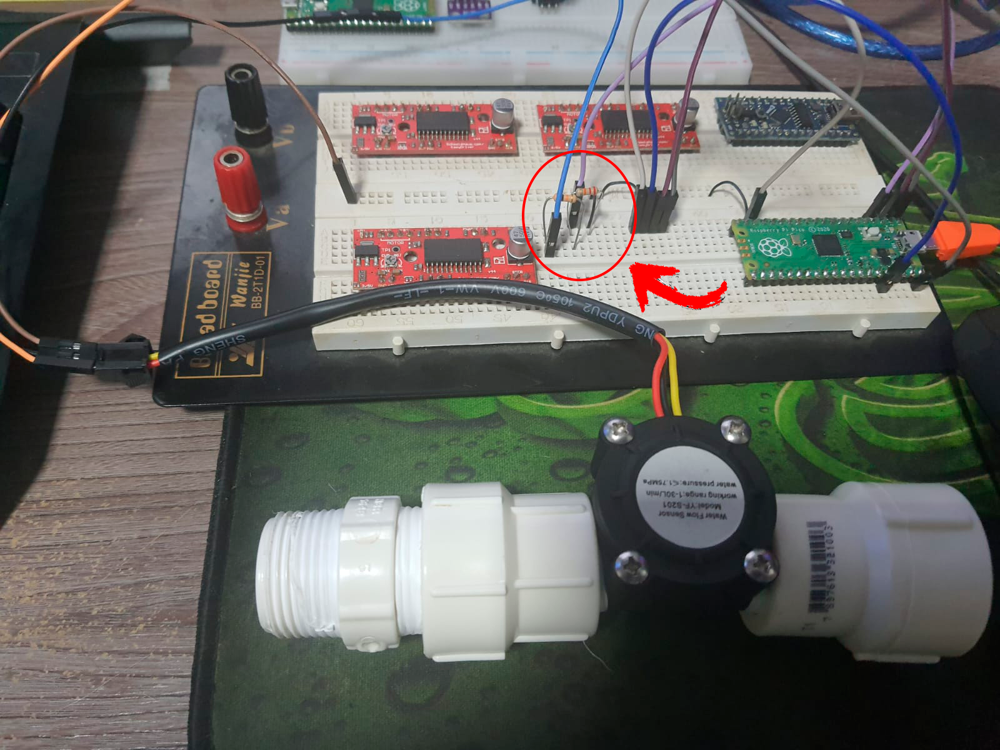
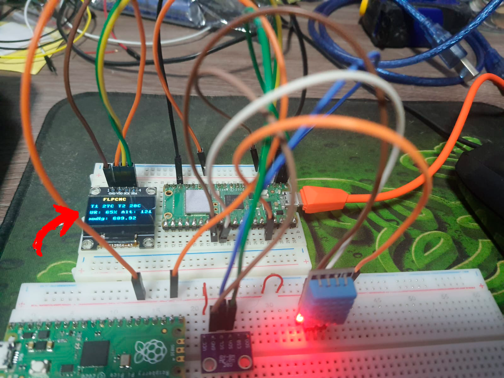
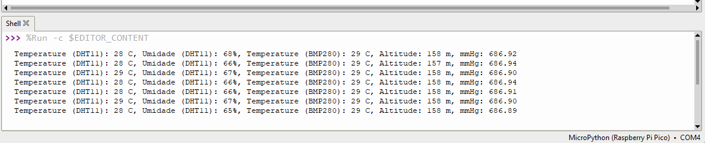

# Raspberry Pi Pico com MicroPython e Sensores

Este repositório contém código e informações sobre como interagir com diferentes sensores usando o Raspberry Pi Pico e MicroPython. Os sensores abordados incluem:

1. Sensor de Temperatura e Umidade DHT11.
2. Sensor de Pressão e Temperatura BMP280.
3. Sensor de Fluxo YF-S201.
4. Integração do DHT11 + BMP280 + DISPLAY OLED

Cada seção abaixo fornecerá detalhes sobre como conectar e usar cada sensor com o Raspberry Pi Pico.

## Post 1: Sensor de Temperatura e Umidade DHT11

Neste post, você aprenderá como interagir com o sensor DHT11 para medir a temperatura e umidade ambiente. 

### Conteúdo do Post:

- ESPECIFICAÇÃO DHT11:
  - Dimensões: 23mm x 12mm x 5mm (incluindo terminais)
  - Alimentação: 3,0 a 5,0 VDC (5,5 Vdc máximo)
  - Corrente: 200uA a 500mA, em stand by de 100uA a 150 uA
  - Faixa de medição de umidade: 20 a 90% UR
  - Faixa de medição de temperatura: 0º a 50ºC
  - Precisão de umidade de medição: ± 5,0% UR
  - Precisão de medição de temperatura: ± 2.0 ºC
  - Tempo de resposta: < 5s
> 
> 
- PINAGEM DHT11:

  - Pino 1: Alimentação – 3,0 a 5,0 VDC; ao (3V3-OUT Pi Pico)
  - Pino 2: Saída Data; ao (GP22 Pi Pico)
  - Pino 3: Não é utilizado;
  - Pino 4: GND – 0V. ao (GND Pi Pico)
> 
> 

- EXEMPLO DE CODIGO:

  [DHT11_EXEMPLO](codigos/DHT11/pi_pico_temp_display.py)

## Post 2: Sensor de Pressão e Temperatura BMP280

Neste post, você aprenderá como usar o sensor BMP280 para medir pressão atmosférica e temperatura.

### Conteúdo do Post:

- Especificações:
  - Tensão de operação: 3V
  - Corrente consumida: incríveis 2.7µA
  - Interfaces de comunicação: I2C e SPI
  - Faixa de medição para pressão: 300 - 1100hPa (equiv. +9000 à -500m acima/abaixo do nível do mar) com precisão de ±0.12hPa
  - Faixa de medição para temperatura: -40 à 85 °C com precisão de ±1.0 °C
  - Dimensões sem os pinos: 15 x 12 x 2,3 mm
> 
> 
- PINAGEM BMP280 VIA I2C:

  - Pino 1: Alimentação – 3.3V VDC; ao (3V3-OUT Pi Pico)
  - Pino 2: GND – 0V. ao (GND Pi Pico)
  - Pino 3: SCL ao (GP1 Pi Pico)
  - Pino 4: SDA ao (GP0 Pi PIco)
>

- EXEMPLO DE CODIGO E BIBLIOTECA UTILIZADA:

Dados do Codigo Exemplo são Impressos no Console da IDE Thony

  [BMP280_EXEMPLO](codigos/BMP280/pi_pico_temp_pressao_bmp280.py)
  

  [BIBLIOTECA BMP280.py](codigos/BMP280/bmp280.py)

  Autor da Biblioteca: bmp280.py
  David Stenwall (david at stenwall.io)

## Post 3: Sensor de Fluxo de Água YF-S201

Neste post, você aprenderá como interagir com o sensor de fluxo de água YF-S201 para medir a quantidade de líquido que passa por ele.

### Conteúdo do Post:

- Especificações técnicas
  - MODELO: YF-S201
  - TIPO DE SENSOR: Efeito Hall
  - TENSÃO DE OPERAÇÃO: 5V a 18V
  - FLUXO DE ÁGUA: 1 a 30 litros / minuto
  - TEMPERATURA DE OPERAÇÃO: -25 a +80 ℃
  - PRECISÃO: ±10%
  - ROSCA EXTERNA: 1/2"
  - PRESSÃO DA ÁGUA MÁXIMA: 2.0 MPa
  - COMPRIMENTO DO CABO: 15cm
  - DIMENSÕES: 6,2 x 3,6 x 3,4 cm (CxLxA)
> 
> 
- Detalhes da conexão

  - FIO VERMELHO: +5V

  - FIO PRETO: GND

  - ATENÇÃO: PARA O FIO AMARELO UTILIZAR DIVISOR DE TENSÃO de 5V para 3.3V ao CONECTAR no GP02 do Pi Pico. Foi Utilizado Resistores R1: 10K e R2: 20K ohms para o nosso Exemplo.

  - FIO AMARELO: Saída PWM (GP02 Pi Pico)
> 

- EXEMPLOS DOS CODIGOS: TESTE E CALIBRAÇÃO DO SENSOR

CODIGO ADAPTADO DO EXEMPLO PARA ARDUINO EM MICROPYTHON NO PI PICO:

1 - PASSO: CODIGO DA MEDIÇÃO

Para calcular a vazão, usamos o fator de conversão, que é fornecido pelo fabricante. Caso não seja fornecido, podemos calcular posteriormente. O programa calcula a frequência dos pulsos do sensor e, em seguida, converte para vazão usando o fator de conversão. No nosso caso, o fator de conversão é 7,5, mas você deve usar o fator apropriado do seu sensor. 

[CODIGO: 01 - MEDIR O FLUXO](codigos/Sensor_Fluxo/medicao_fluxo.py)

2 - PASSO: MEDINDO VOLUME OU CONSUMO DE ÁGUA

Com a vazão, é possível medir o volume de água, uma vez que a vazão representa a mudança no volume ao longo do tempo. No monitor serial, recebemos informações sobre a vazão e o volume. Para redefinir o volume, basta enviar a letra 'r', e o volume será reiniciado em 0.

[CODIGO: 02 - VOLUME OU CONSUMO DE ÁGUA](codigos/Sensor_Fluxo/vol_consumo_agua.py)

3 - PASSO: CALIBRAR O SENSOR

Para obter medições precisas, é essencial calcular o fator de conversão, que relaciona a frequência de pulsos ao fluxo de água. Podemos medir o número de pulsos com precisão usando o Pi Pico e determinar o volume de água com um recipiente graduado. Utilizando essas duas variáveis, podemos calcular o fator de conversão usando a fórmula: K = (n°Pulsos / volume). Para obter resultados mais precisos, é recomendável realizar várias amostras e calcular a média. Em nosso caso, obtivemos um fator de conversão de 4,86, o que nos permite realizar medições mais precisas com base nesse valor.

[CODIGO: 03 - CALIBRANDO O NOSSO SENSOR](codigos/Sensor_Fluxo/calibrando_sensor_fluxo.py)

LINK ORIGINAL ARDUINO: 
[Tutorial YF-S201 para Arduino](https://naylampmechatronics.com/blog/47_tutorial-sensor-de-flujo-de-agua.html)

## Post 4: Integração DHT11 / BMP280 / DISPLAY OLED

## Monitor de Condições Ambientais

O codigo a seguir em Micropython e Raspberry Pi Pico pode ser utilizado em monitoramento de condições ambientais, incluindo temperatura, umidade, pressão, altitude e pressão atmosférica. O script utiliza sensores DHT11 e BMP280 para realizar as medições. Aqui está uma visão geral das funcionalidades do script:

- **Configuração do Hardware:** O código configura um display OLED, um sensor DHT11 e um sensor BMP280.

- **Medição de Temperatura e Umidade:** Utilizando o sensor DHT11, o script mede a temperatura e a umidade com precisão.

- **Leitura de Dados do Sensor BMP280:** Os dados de pressão e temperatura são lidos a partir do sensor BMP280, com ajustes para calcular a pressão ao nível do mar e a altitude.

- **Exibição em Display OLED:** Os dados medidos são exibidos em um display OLED, permitindo a visualização das condições atuais.

- **Registro em Arquivo CSV:** Os dados são registrados em um arquivo CSV chamado "data.csv" para análise e registro de longo prazo.

- **Impressão no Console:** Os dados também são exibidos no console, fornecendo informações em tempo real.

- **Atraso entre Leituras:** O script realiza leituras em intervalos regulares, com um atraso de 15 segundos entre as leituras.

Este código é útil para monitorar as condições ambientais em um local específico e pode ser adaptado para diversos fins, como monitoramento de temperatura e umidade em ambientes internos ou externos. Os dados registrados podem ser posteriormente utilizados para análises ou para tomar ações com base nas condições ambientais.

Sinta-se à vontade para personalizar e adaptar o código de acordo com suas necessidades específicas.

Impressão dos dados no Console e Envio para o Arquvivo data.csv

[CODIGO: SENSORES INTEGRADOS DHT11, BMP280 e DISPLAY OLED, DATA.CSV](codigos/DHT11_BMP280_DISPLAY_OLED/pico_dht11_bmp280_Oled_Display.py)

## Contribuições

Contribuições para a melhoria deste repositório são bem-vindas! Sinta-se à vontade para abrir problemas, enviar solicitações de pull e adicionar informações adicionais ou correções aos posts existentes.

