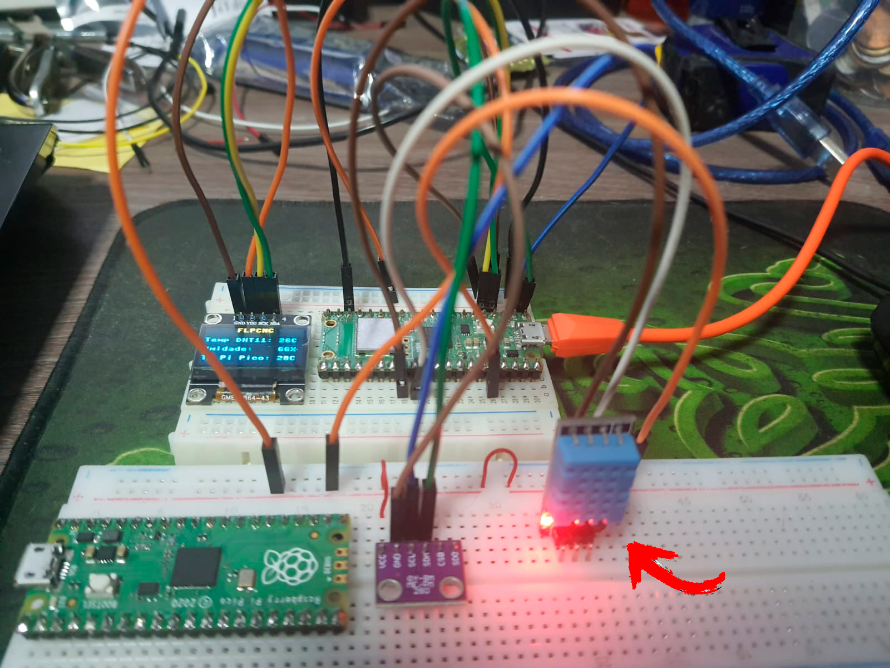
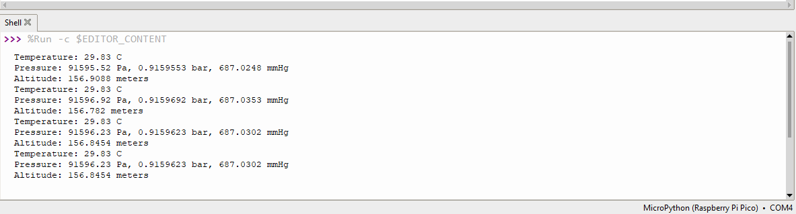
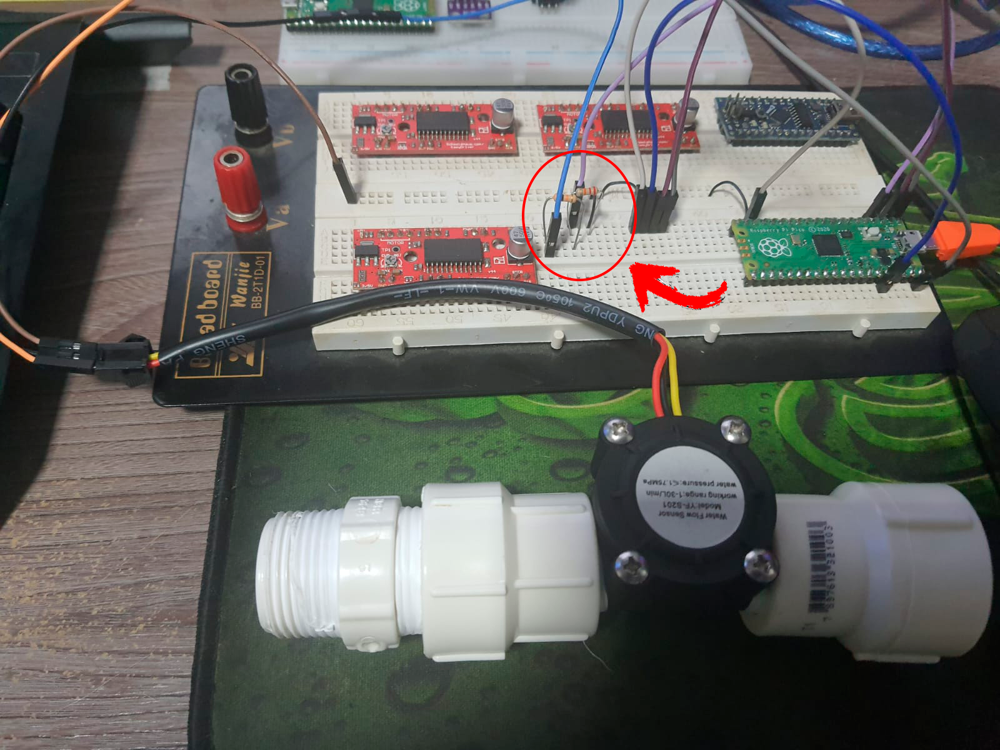
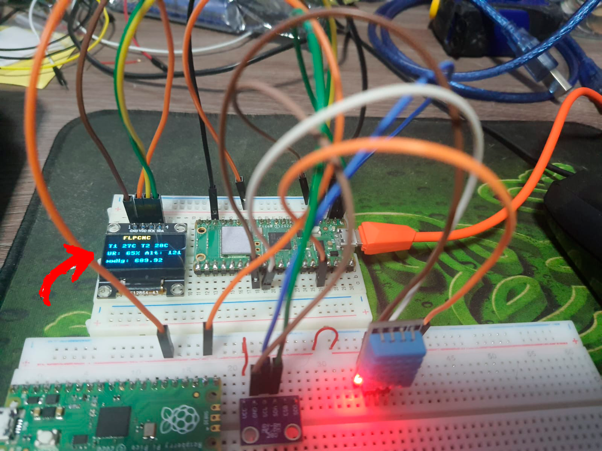
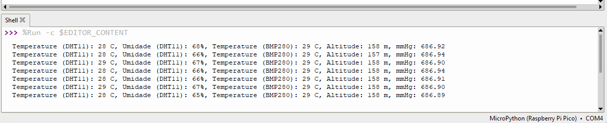

# 🌡️ Raspberry Pi Pico com MicroPython e Sensores

Este repositório contém exemplos e um **projeto integrado** de monitoramento ambiental utilizando o **Raspberry Pi Pico** e **MicroPython**.  

Os sensores abordados incluem:

1. **DHT11** – Temperatura e Umidade  
2. **BMP280** – Pressão atmosférica e Temperatura  
3. **YF-S201** – Sensor de Fluxo de Água  
4. **Integração DHT11 + BMP280 + Display OLED** com registro em CSV  

---

## 📑 Índice
- [📂 Estrutura do Repositório](#-estrutura-do-repositório)
- [📗 Exemplos por Sensor](#-exemplos-por-sensor)
  - [DHT11](#1-sensor-de-temperatura-e-umidade-dht11)
  - [BMP280](#2-sensor-de-pressão-e-temperatura-bmp280)
  - [YF-S201](#3-sensor-de-fluxo-de-água-yf-s201)
- [🌡️ Projeto Integrado - Estação Ambiental](#4-integração-dht11--bmp280--display-oled)
- [🖼️ Diagramas e Imagens](#️-diagramas-e-imagens)
- [🤝 Contribuições](#-contribuições)

---

## 📂 Estrutura do Repositório

📂 Pi-Pico-Projects
│── 📂 src # Projeto integrado (main.py + config.py)
│── 📂 exemplos # Exemplos individuais por sensor
│── 📂 data # Saída de dados (CSV)
│── 📂 docs/img # Documentação e imagens
│── README.md
│── LICENSE

---

## 📗 Exemplos por Sensor

### 1. Sensor de Temperatura e Umidade DHT11

- Faixa de umidade: 20 a 90% UR (±5% UR)  
- Faixa de temperatura: 0ºC a 50ºC (±2 ºC)  
- Pinagem:
  - VCC 3.3V
  - DATA → GP22  
  - GND  

📷 **Imagem:**  

📜 **Exemplo de código:**  
[➡️ dht11_example.py](exemplos/dht11_example.py)

---

### 2. Sensor de Pressão e Temperatura BMP280

- Faixa de pressão: 300 – 1100 hPa (±0.12hPa)  
- Faixa de temperatura: -40 a 85 °C (±1.0 °C)  
- Interface: I²C  
- Pinagem:
  - VCC → 3.3V  
  - GND → GND  
  - SCL → GP1  
  - SDA → GP0  

📷 **Imagem:**  
  

📟 Saída no Thonny Console:  

📜 **Exemplo de código:**  
[➡️ bmp280_example.py](exemplos/bmp280_example.py)  
[➡️ biblioteca bmp280.py](exemplos/bmp280.py)  

---

### 3. Sensor de Fluxo de Água YF-S201

- Faixa de fluxo: 1–30 L/min (±10%)  
- Tensão de operação: 5–18V  
- Sinal de saída: PWM (ajustado para GP02 via divisor resistivo)  

📷 **Imagem:**  

📜 **Exemplos de código:**
- [➡️ Medição de fluxo](exemplos/yf-s201_fluxo.py)  
- [➡️ Volume e consumo de água](exemplos/yf-s201_volume.py)  
- [➡️ Calibração do sensor](exemplos/yf-s201_calibracao.py)  

📖 **Referência Arduino:**  
[Tutorial YF-S201 para Arduino](https://naylampmechatronics.com/blog/47_tutorial-sensor-de-flujo-de-agua.html)

---

## 4. Integração DHT11 + BMP280 + Display OLED

### Monitor de Condições Ambientais

O código em `src/main.py` implementa uma mini **estação ambiental**:

- Configura display OLED via I²C  
- Lê dados do DHT11 (temperatura + umidade)  
- Lê dados do BMP280 (pressão, temperatura + altitude estimada)  
- Exibe todas as informações no OLED em tempo real  
- Salva os dados no arquivo `data/data.csv` para análise histórica  
- Imprime também no Console (IDE Thonny)  
- Intervalo padrão: leitura a cada **15 segundos**

📷 **Visualização no OLED + exportação CSV:**  
  

📜 **Código principal:**  
[➡️ main.py](src/main.py)

---

## 🖼️ Diagramas e Imagens

As ligações elétricas e exemplos de montagem estão disponíveis em:  
[📂 docs/img](docs/img)

---

## 🤝 Contribuições

Contribuições para a melhoria deste repositório são **bem-vindas**!  
Você pode:
- Abrir **issues** com dúvidas ou sugestões  
- Enviar **pull requests** com melhorias no código ou documentação  

---

## 📜 Licença

Este projeto está licenciado sob os termos da **Licença MIT**.  
Consulte o arquivo [LICENSE](LICENSE) para mais detalhes.
